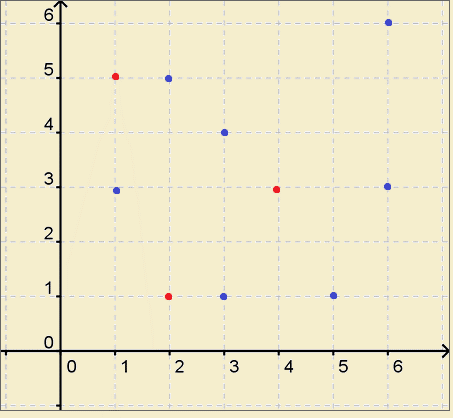
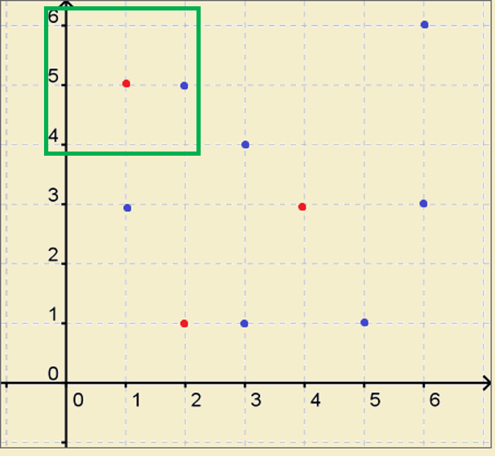
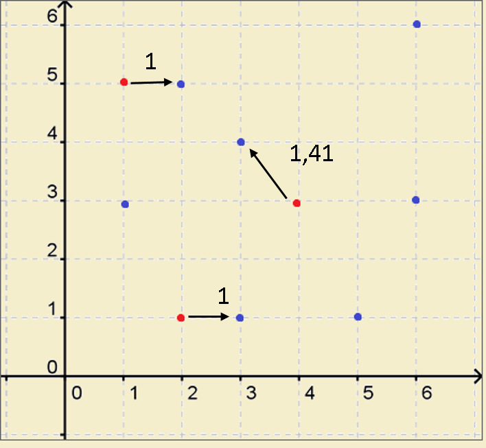
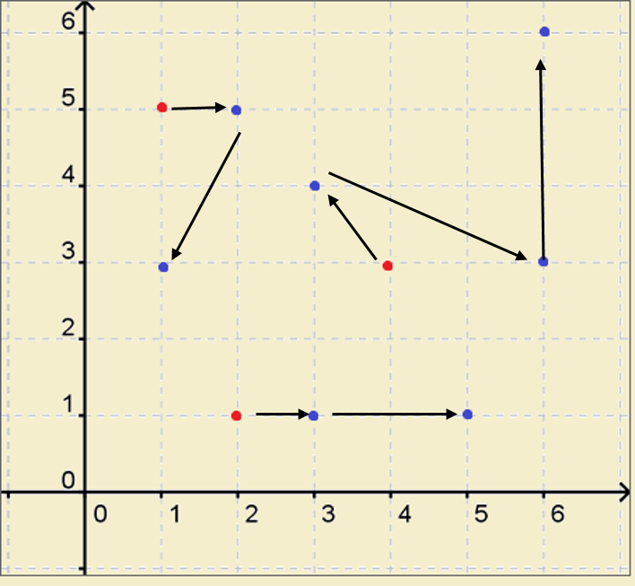

## Análisis Preliminar de posible Algoritmo

Se presenta una variación al Problema de Enrutamiento de Vehículos. Tenemos un conjunto de almacenes de donde se debe recorrer todos los puntos de entrega que se encuentren. Debido a ello, describiré a detalle el posible algoritmo a usar para la resolución del presente ejecicio.

Necesitamos una función que reciba la lista de puntos de entrega y almacenes. Se siguen los siguientes pasos.

- Almacenes: Puntos Rojos
- Puntos de Entrega: Puntos Azules

1. Realizar un for para recorrer por cada uno de los almacenes.

2. En un almacén verificar en un rango X si existen puntos de entrega. Si es así, deben agregarse a una lista
 

`[(1, 5)]` Esta lista se agregará a otra, que llamaremos `PuntosCandidatos`, la cual incluirá los puntos más cercanos de otros almacenes.

`[[(1, 5)], [Puntos cercanos de otro almacén], [...], [...], ...]`

3. Si es que no se encuentras puntos de entrega, aumentar el rango de búsqueda. La sgunda verificación se debe ahcer después que los demás almacenes hayan buscado sus puntos de entrega con el rango por defecto.

4. Una vez cada almacén tenga su lsita de puntos de entrega en un rango y a su vez estas se hallan guardado en la lista `PuntosCandidatos`. Se debe obtener el punto de entrega más cercano de cada almacén y verificar si en ningún otro se repite. Si es así, se dbee escoger el que conlleveme menos distancia entre los dos, y el de mayor debe elegir su siguiente punto más cercano. Si es que se qued sin ninguno debe realizar una siguiente búsqueda aumentando su rango.

> Ejemplo:
> 
> Puntos Cercanos A: [(1, 6), (2, 5)] -
> Punto Almacén A: (1, 5) -
> Punto más Cercano: (1, 6). Distancia: 1
>   
> Puntos Cercanos B: [(1, 6), (0, 7)] -
> Punto Almacén B: (1, 7) -
> Punto más Cercano: (1, 6).
> 
> Ya que el Almacén A tiene el mismo punto como el más cercano, y su distancia hacia esta es la misma, el almacén B debe elegir el siguiente punto.
> 
> Puntos más cercano: (0, 7). Distancia: 1

5. El punto recorrido se agregará a una lista del recorrido realizado por cada almacén, teniendo sus coordenadas como inicio de su lista

`[[(1, 5), (2, 5)], [(4, 3), (3, 4)], [(2, 1), (3, 1)]]`

6. Finalmente, el último punto en la lista de cada recorrido, buscará su punto más cercano, repitiendo el proceso otra vez hasta que todos los puntos de entrea hallan sido recorridos.

`[[(1, 5), (2, 5), (1,3)], [(4, 3), (3, 4), (6, 3), (6, 6)], [(2, 1), (3, 1), (5, 1)]]`

Una vez acabado el proceso, obtenemos un arreglo con todos los puntos recorridos por cada uno de los almacenes. Sin embargo, al existir varios agentes y no poder retroceder en el proceso una vez se haya trazado un camino, existe la posibilidad que se hallen caminos más cortos. Por lo que el presente proceso de mantendrá en análisis.
Finalmente, se optó por este proceso ya que en su notación BigO, lleva a ser un tiempo cuadrado. ¿Por qué? El proceso anteriormente visto, es inspirado en el algoritmo **Depth Limited Search**. Debido a que se presenta un limite en el rango de la búsqueda, y al no llegar al objetivo deseado, este aumenta.

